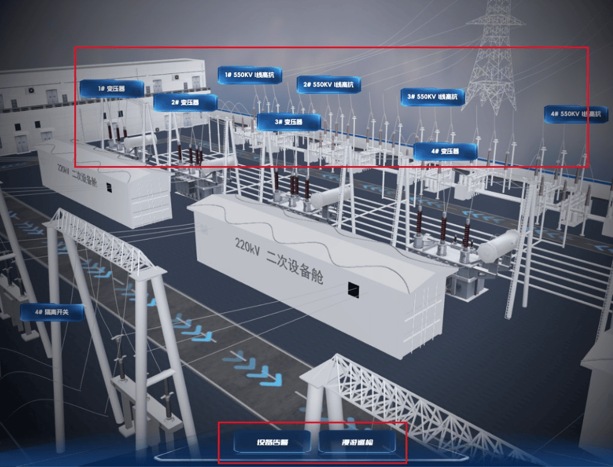

# 变电站数字孪生可视化大屏

[](https://github.com/zybkpro/ZP-PowerSubstation/stargazers)
[](https://zybkpro.github.io/ZP-PowerSubstation/)

Vue3 + Three.js 变电站 / 电厂**数字孪生监控大屏**。中间为可交互三维站房场景，两侧为 ECharts 实时数据看板，支持设备标签点击查详情、漫游巡检、故障告警高亮，以及蓝绿双主题。

> **关键词：** 数字孪生 · 变电站监控大屏 · Three.js 工业可视化 · Vue3 大屏 · GLB 模型 · ECharts 实时图表 · WebGL · 智慧能源

**在线演示：**

- GitHub Pages：[zybkpro.github.io/ZP-PowerSubstation](https://zybkpro.github.io/ZP-PowerSubstation/)

## 预览



[▶ 在线体验：GitHub Pages 演示](https://zybkpro.github.io/ZP-PowerSubstation/)

Topics 与 About 配置见 [docs/GITHUB_SEO.md](./docs/GITHUB_SEO.md)。

## 功能亮点

- **三维站房** — Three.js 加载站房 / 设备 / 线路模型，轨道漫游与视角动画
- **设备标签** — CSS2D 设备标注，点击打开详情弹窗（电压、电流、温度、负载等）
- **巡检 / 告警** — 模拟巡检漫游路径，告警时故障设备红色高亮定位
- **数据看板** — 设备规模、负荷电流、系统损耗、故障对比等图表（动态刷新）
- **视频监控 / 预警列表** — 四路监控网格与告警滚动展示
- **双主题** — 蓝色（默认）/ 绿色一键切换，Header、侧栏、标签、加载动画联动

## 适用场景

- 工业数字孪生 / 智慧能源大屏学习与参考
- Three.js + Vue3 3D 交互项目练手
- 变电站监控、电力可视化 Demo 演示

## 快速开始

```bash
yarn install
yarn dev        # http://localhost:8090
yarn build      # 输出到 dist/
yarn preview    # 预览构建结果
```

## 可用脚本

| 命令          | 说明                         |
| ------------- | ---------------------------- |
| `yarn dev`    | 本地开发（端口 8090）        |
| `yarn build`  | 生产构建，产物输出至 `dist/` |
| `yarn preview`| 预览构建结果                 |

## 技术栈

| 类别 | 技术 |
|------|------|
| 框架 | Vue 3 · TypeScript · Vite |
| 三维 | Three.js · GLTF / Draco · RGBELoader · TWEEN |
| 图表 | ECharts |
| 样式 | Sass · 大屏自适应布局 |

## 部署

### GitHub Pages

`https://zybkpro.github.io/ZP-PowerSubstation/`

推送到 `main` 后 Actions 自动部署；Settings → Pages → Source = GitHub Actions。

### nginx 静态托管

`base` 为相对路径 `./`，可将 `dist/` 放到任意子目录：

```bash
yarn build
rsync -avz --delete dist/ user@server:/usr/share/nginx/html/threejs/powerSubstation/
```

## 项目结构

```
src/
├── components/          # 大屏面板、页头页脚、设备弹窗等
├── hooks/
│   ├── useThree.ts      # Three.js 场景初始化与环境贴图
│   ├── useStation.ts    # 模型加载、巡检、告警逻辑
│   ├── useEcharts.ts    # 图表封装
│   └── useDeviceModal.ts
└── App.vue              # 大屏主布局
public/
├── models/              # glb / hdr 三维资源
├── images/              # 监控示意图片
└── js/draco/            # Draco 解码器
docs/                    # SEO 配置与预览图
```

## Star

如果这个项目对你有帮助，欢迎点个 **Star** ⭐ 支持一下。
